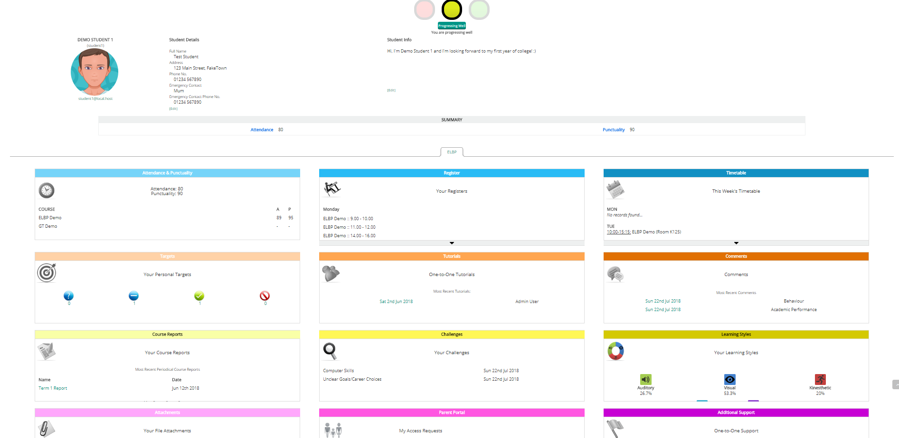
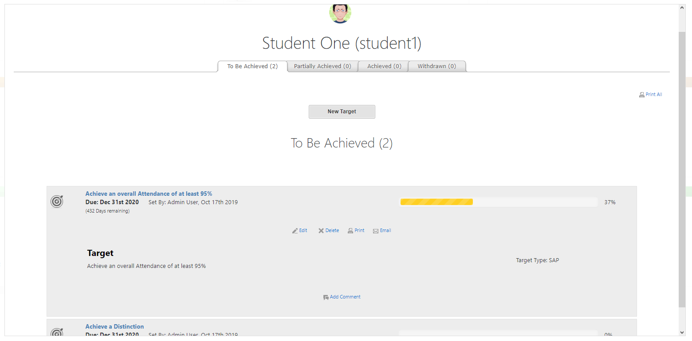
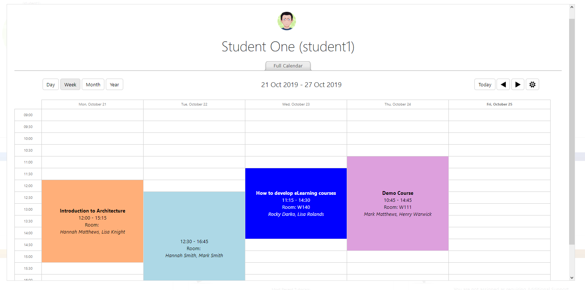
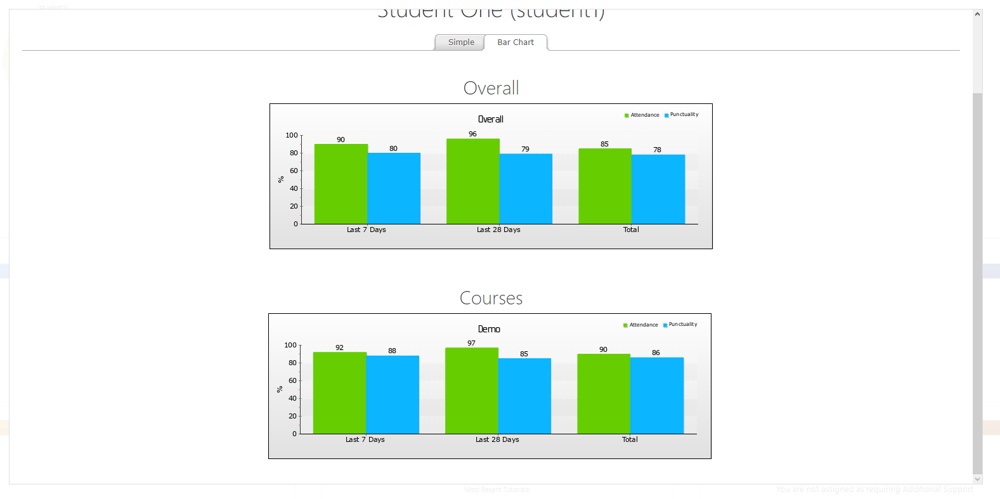
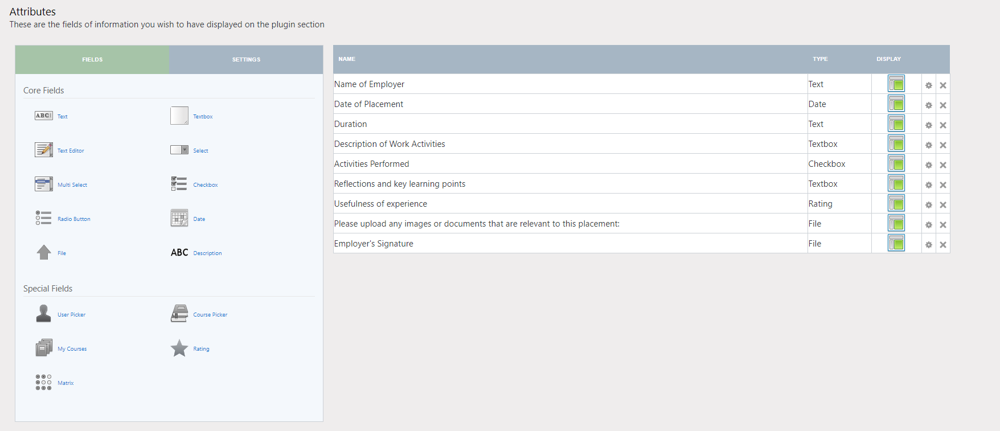
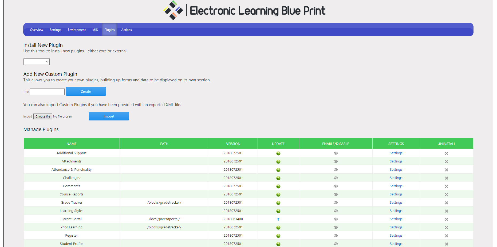
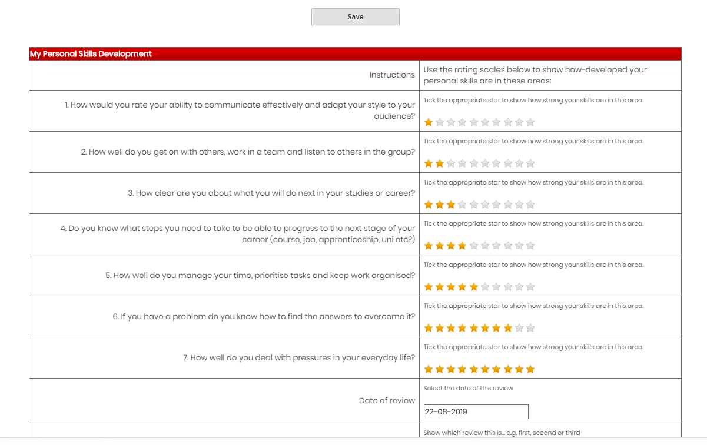

# Electronic Learning Blue Print (v2.0.1)

This plugin provides you with the Electronic Learning Blue Print block, which is an Individual Learning Plan system, which provides you with one centralised place to see all of the information relevant for a student, such as Attendance, Targets, Timetables, Registers, etc...

Features
------------
The PLP is feature-rich and allows you to customise almost every aspect of it, so that you can implement it in a way which works best for your institution.

Some of these features include:

* 9 Built-in plugins
	* Attendance & Punctuality
	* Register
	* Targets
	* Tutorials
	* Comments
	* Course Reports
	* Attachments
	* Challenges
	* Learning Styles
	* Additional Support
	* Timetable

* 2 Additional plugins when you use the Grade Tracker block
	* Grade Tracker
	* Prior Learning

* Customise - Build your own custom plugins from 5 available types
	* Single Reports - Static forms. One per student.
	* Incremental Reports - A table of information, entered row by row.
	* Multiple Reports - Create multiple instances of the same report, with different values.
	* Internal DB - A read-only report, drawing data out of your Moodle database, as defined by an SQL query
	* External DB - A read-only report, drawing data out of an external database, as defined by an SQL query

* MIS Integration - Display data direct from your MIS/SIS system. Supports the following data sources:
	* MySQL
	* SQL Server
	* PostgreSQL
	* Oracle
	* Firebird
	* Microsoft Access
	* SQLite

* Email Alerts - Set up custom alerts to suit your particular needs, based on PLP events, against whole courses, course groups or individual students.
* Report - See overview reports and build up your own custom reports which can be exported to Excel or saved into the system for later comparisons.

User Guide
------------
[Please see the Wiki](https://github.com/cwarwicker/moodle-block_elbp/wiki)

Screenshots
-----------

Viewing a Student's ELBP:

Viewing a Student's Targets:

Viewing a Student's Timetable:

Viewing a Student's Attendance data:

Configuring a custom form:

ELBP Plugin Configuration:

Viewing a Student's Customised Plugin (Personal Skills Development):

Requirements
------------
- Moodle 3.4, 3.5, 3.6, 3.7
- Plugin block_df_dashboard installed
- Plugin local_df_hub installed

Installation
------------
1. Download the latest version of the plugin from the [Releases](https://github.com/cwarwicker/moodle-block_elbp/releases) page.
2. Extract the directory from the zip file and rename it to 'elbp' if it is not already named as such.
3. Place the 'elbp' folder into your Moodle site's */blocks/* directory.
4. Run the Moodle upgrade process either through the web interface or command line.
5. Add the block to a page and start using it

License
-------
https://www.gnu.org/licenses/gpl-3.0

Support
-------
If you need any help using the block, or wish to report a bug or feature request, please use the issue tracking system: https://github.com/cwarwicker/moodle-block_elbp/issues

If you want to help out with the development, feel free to submit commits for review.